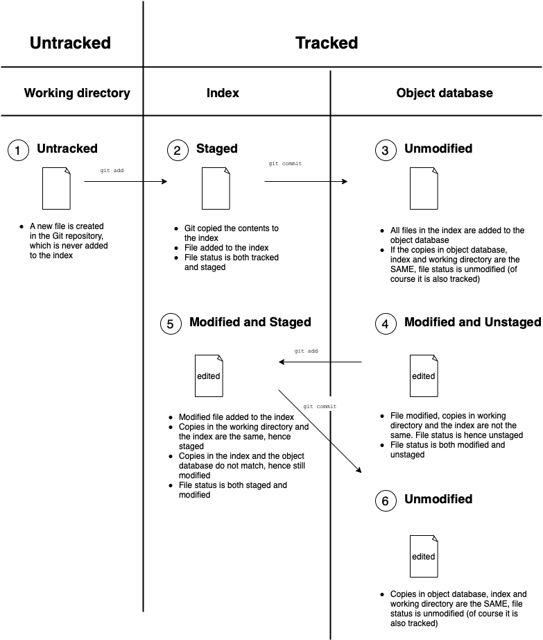
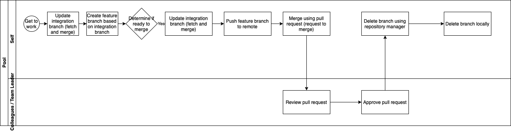

# Gitcheatsheet

## Glossary

- Commit: A commit is a pointer to the location inside the .git folder where Git has stored your changes.
- HEAD: The commit you are on is referred to as HEAD. HEAD is a reference to a commit. HEAD is updated every time you switch or merge branches.
- Acyclicity Nature of the Git Commit history: The Git Commit history is a Directed Acyclic Graph （"DAG"), where the commits form the nodes and the pointers to the parents form the edges. The acyclicity property ensures the commit history is well-defined and cannot contain cycles or loops, where parents do not point back to their children.
- Branch: A branch is simply a reference to a commit via its ID. This reference is updated every time you make another commit on that branch.
- Remote Tracking Branch: Git uses remote tracking branches as liaisons between local branches in a clone and their counterparts in the remote. If you add commits to a local branch that has an associated remote tracking branch, Git can compare the commits and inform you that you need to push.
- Pull Request: Terminology of GitHub but could be more appropriatey coined as a "merge requests" - a request to merge the code in one branch into another branch.

## Explaining the Git file lifecycle

## Proposed workflow

# Insert proposed workflow.

1. Create a new branch: Each time you start work on a new feature or bug fix, create a new branch from the main development branch. This ensures that you're working on a clean slate and that you can easily merge your changes back into the main branch.
2. Make changes and commit them: Make your changes to the code and commit them frequently, with clear and descriptive commit messages.
3. Write and run tests: As you make changes to the code, write and run tests to ensure that your changes are working as expected and do not introduce new bugs.
4. Pull from the main branch regularly: Make sure to regularly pull from the main branch to keep your branch up to date with the latest changes.
5. Push your branch to the remote repository: When you're ready to share your changes with the rest of the team, push your branch to the remote repository.
6. Open a pull request: Once you've pushed your changes to the remote repository, open a pull request to request feedback and review from other team members.
7. Review code and tests: Other team members review the code changes and tests to ensure that the changes are consistent with project standards and requirements.
8. Approve or request changes: The reviewer either approves the changes or requests additional changes to be made.
9. Address feedback and make changes: If changes are requested, review and address the feedback, making any necessary changes and pushing updates to your branch.
10. Run tests again: Once you've made changes based on feedback, run your tests again to ensure that your changes are still working as expected.
11. Merge your changes: Once your changes have been reviewed and approved, merge your changes back into the main branch.
12. Run tests on the main branch: After merging your changes, run tests on the main branch to ensure that everything is still working correctly.
13. Tag and release: When it's time to release a new version of the software, create a tag in the repository to mark the release, and update any relevant documentation.

## Useful Tips

---

### Use Revert (such as `git revert Head`) over Reset

Unfortunately, the internet is plagued by tutorials that advocate using `git reset` to undo changes (not to mention using hard mode and losing all changes).

`git revert` is a safer way to undo changes, especially when working with multiple developers. Think of `git revert` as an "anti-commit" - for every file added, you could delete it, and vice versa. For every line in every file that was added, you delete it, and for every line that was deleted, bring it back.

`git revert` creates a new commit and keeps the commit history intact, whereas `git reset` completely removes changes from the commit history, making it a destructive operation. If you reset to a previous commit and then push that to a shared repository, you're effectively overwriting the history of the repository, which can cause problems for other developers who are working on the same codebase. This can result in conflicts, confusion, and lost work.

---

### Avoid whitespace in filenames and paths

Best to avoid quotes as well.

---

### Use git fetch + git merge. Avoid git pull

`git pull` updates a specific branch.It first fetches all new commits on the remote, then updates (merge) the local branch’s commit history to look like the remote’s.

Prior to pushing, it’s good practice to first fetch. Since fetch only updates the remote tracking branches, Git can tell you if the local branch has diverged away from
the remote branch.

To update the local branch with any commits on the remote tracking branch, you can merge the remote tracking branch into the local branch. This gives you the opportunity to think about what you want to do if your local branch has diverged away from the remote.

---

## Useful Commands

### Safe commands

- `git status`: asks the repository for information to display and in no way affects the repository
- `git log --graph --oneline --all`: useful command to view commit history in a DAG format, especially when learning git or visualisation tools such as GitLens and SourceTree are not available
- `git diff`: Shows the differences between your index and the working directory
- `git diff --cached` or `git diff --staged`: Shows the differences between your index and the last commit.
- `git diff <commit / branch> <commit / branch>`: (Note: should input 2 parameters and be specific)
Shows the differences between two specified commits or two specified branches.
- `git revert HEAD`: Super convenient if you want to undo the latest commit.
- `git branch`: Lists all the local branches in your repository
- `git branch -r`: Lists all the remote branches in your repository.
- `git branch -a`: Lists all the local and remote branches in your repository.
- `git branch -vv`: List all your branches alongside their remote tracking branches (if any).
- `git fetch --prune`: Downloads new commits from the remote repository, and remove any remote tracking branches that no longer exist on the remote repository.
- `git merge <branch>`: Merges the specified branch into your current branch.
- `git rebase <branch>`: Replays your commits on top of the specified branch. 
